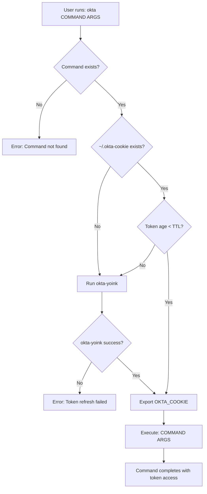

# Okta Shim Wrapper Design

## Overview

The `okta` shim is a bash wrapper script that provides transparent Okta token management for command-line tools requiring authentication. It intelligently caches tokens and automatically refreshes them when expired, eliminating the need for users to manually manage authentication state.

## Architecture

### Core Concept

The shim acts as a transparent proxy between the user and their target command, or as a standalone token manager:

```bash
# User types (with command):
okta persona -o Engineering -m dec

# Shim internally:
# 1. Validates 'persona' command exists
# 2. Checks token freshness
# 3. Refreshes token if needed
# 4. Exports OKTA_COOKIE environment variable
# 5. Executes: persona -o Engineering -m dec

# User types (standalone):
okta

# Shim internally:
# 1. Checks token freshness
# 2. Refreshes token if needed
# 3. Exports OKTA_COOKIE environment variable
# 4. Returns (token available in shell)

# User types (silent mode):
okta -s persona -o Engineering -m dec

# Shim internally:
# 1-5. Same as above, but suppresses [okta] output messages
```

### Token Lifecycle Management



## Implementation Details

### File Structure

```
okta-yoink/
├── bin/
│   └── okta.sh              # Main shim function (bash, sourced)
├── docs/
│   └── okta-shim-design.md  # This document
└── ...
```

### Script Location and Execution

- **Path**: `bin/okta.sh` (relative to project root)
- **Language**: Bash (compatible with zsh shells)
- **Execution Method**: Sourced as shell function (not executed as script)
- **Installation**: User sources the file to define the `okta()` function

### Environment Variables

#### Configuration

| Variable | Default | Description |
|----------|---------|-------------|
| `OKTA_YOINK_TTL` | `3600` | Token time-to-live in seconds (1 hour) |
| `OKTA_YOINK_REPO` | *(auto-discovered)* | Path to okta-yoink repository (auto-discovered via git) |

#### Runtime

| Variable | Source | Description |
|----------|--------|-------------|
| `OKTA_COOKIE` | `~/.okta-cookie` | OAuth2 proxy token exported to shell |

### Token Freshness Logic

```bash
# Pseudocode
current_time = $(date +%s)
file_mtime = $(stat -f %m ~/.okta-cookie 2>/dev/null || echo 0)
age = $((current_time - file_mtime))
ttl = ${OKTA_YOINK_TTL:-3600}

# Auto-discover repository path
if [[ -n "$OKTA_YOINK_REPO" ]]; then
    repo_path = "$OKTA_YOINK_REPO"
else
    script_dir = $(dirname ${BASH_SOURCE[0]})
    repo_path = $(git -C "$script_dir" rev-parse --show-toplevel)
fi

if [[ $age -gt $ttl ]]; then
    # Token is stale, refresh needed
    cd "$repo_path" && uv run okta-yoink
fi
```

### Command Validation

The shim validates the target command exists before processing tokens:

```bash
if ! command -v "$target_command" >/dev/null 2>&1; then
    echo "[okta] Error: Command '$target_command' not found" >&2
    exit 1
fi
```

### Error Handling Strategy

All failures result in immediate termination with descriptive error messages:

1. **Command Not Found**: Target command doesn't exist in `$PATH`
2. **Token File Issues**: Cannot read/access `~/.okta-cookie`
3. **Refresh Failure**: `okta-yoink` exits with non-zero status
4. **Permission Issues**: Cannot execute target command

Error format: `[okta] Error: <description>` to stderr

## User Experience

### Typical Workflow

```bash
# Standalone use (just get authenticated)
$ okta
[okta] OKTA_YOINK_TTL=3600
[okta] OKTA_YOINK_REPO=~/repos/scottidler/okta-yoink
[okta] Token not found, refreshing...
🚀 Starting Okta token extraction...
# ... browser automation for MFA ...
✅ Token saved to ~/.okta-cookie
[okta] Token ready for use in current shell session

# Now any command can use the token
$ some-command-that-needs-okta
# ... command executes with OKTA_COOKIE available ...

# Or use with command wrapper (traditional mode)
$ okta persona -o Engineering -m dec
[okta] OKTA_YOINK_TTL=3600
[okta] OKTA_YOINK_REPO=~/repos/scottidler/okta-yoink
[okta] Using cached token
[okta] Token exported to OKTA_COOKIE (persists in shell)
[okta] Executing: persona -o Engineering -m dec

# ... persona command executes with authentication ...

# Later use (token expired)
$ okta
[okta] Token expired, refreshing...
# ... browser automation repeats ...
[okta] Token ready for use in current shell session
```

### Transparent Authentication

- **Dual Mode**: Works as command wrapper or standalone token manager
- **Standalone Mode**: `okta` alone refreshes token and exports to shell
- **Wrapper Mode**: `okta COMMAND` wraps any command with authentication
- **Silent Mode**: `okta -s` or `okta --silent` suppresses okta output messages
- **Configuration Display**: Shows TTL and repository path at start (unless silent)
- **Clean Output**: Adds empty line between okta messages and command output
- Users never directly manage tokens
- Authentication state persists across shell sessions
- No manual `export` commands needed
- Works with any command requiring `OKTA_COOKIE`

## Technical Specifications

### Shell Compatibility

- **Primary**: Bash function (sourced, not executed)
- **Compatible**: Works in zsh and other bash-compatible shells
- **Architecture**: Main function with nested helper functions
- **Requirements**: Standard Unix utilities (`date`, `stat`, `command`)

### Token Storage

- **Location**: `~/.okta-cookie`
- **Format**: `_oauth2_proxy=<token_value>`
- **Permissions**: `600` (user read/write only)
- **Managed by**: `okta-yoink` application

### Performance Characteristics

- **Fast path**: Command validation + file stat (~1ms)
- **Slow path**: Full browser automation (~10-15 seconds)
- **Memory**: Minimal (bash script overhead only)
- **Network**: Only during token refresh

## Security Considerations

### Token Protection

- Token file has restrictive permissions (`600`)
- Environment variable scoped to current shell tree
- No token logging or debugging output
- Browser automation uses secure WebDriver protocols

### Attack Surface

- Function validates command existence (prevents injection)
- No user input parsing beyond argument pass-through
- Nested functions provide encapsulation without global namespace pollution
- Relies on `okta-yoink` security model for authentication
- Token automatically expires based on TTL

## Integration Points

### With okta-yoink

- Calls `okta-yoink` binary for token refresh (using `OKTA_YOINK_REPO` path)
- Reads token from `~/.okta-cookie` file
- Inherits all authentication and MFA handling
- No direct Okta API integration

### With Target Commands

- Exports `OKTA_COOKIE` environment variable
- Passes through all command arguments unchanged
- Preserves exit codes and output streams
- No modification of command behavior

### With Shell Environment

- **Function-based**: Runs as shell function, not subprocess
- **Persistent Exports**: `OKTA_COOKIE` persists in current shell session
- **Nested Functions**: Uses helper functions defined within main `okta()` function
- Compatible with shell scripting and automation
- Respects existing environment variables
- Works with shell aliases and other functions

## Future Enhancements

### Potential Features

- **Multiple Profiles**: Support different Okta domains/configs
- **Token Introspection**: Validate token before use
- **Metrics**: Track token refresh frequency
- **Configuration File**: Alternative to environment variables
- **Parallel Safety**: Handle concurrent token refreshes

### Backward Compatibility

- Environment variable names may evolve
- Core command interface will remain stable
- Token file format tied to `okta-yoink` implementation
- Shell compatibility maintained across versions

## Testing Strategy

### Unit Testing

- Command validation logic
- Token freshness calculations
- Error handling paths
- Environment variable handling

### Integration Testing

- End-to-end workflow with real commands
- Token refresh scenarios
- Shell compatibility verification
- Error condition simulation

### Manual Testing

- Browser automation interaction
- MFA (YubiKey) workflow
- Multiple shell environments
- Permission and security validation

## Deployment

### Installation

1. Clone repository
2. Source the function definition: `source bin/okta` or `. bin/okta`
3. Add to shell startup file (e.g., `~/.bashrc`, `~/.zshrc`) for persistence
4. Configure environment variables if needed

**Example Installation:**
```bash
# One-time setup
echo "source ~/repos/scottidler/okta-yoink/bin/okta.sh" >> ~/.zshrc

# Or for current session only
source bin/okta.sh
```

### Dependencies

- `okta-yoink` repository at `$OKTA_YOINK_REPO` location
- Standard Unix utilities (`date`, `stat`, `command`)
- Bash shell (version 3.0+)
- `uv` package manager (for running `uv run okta-yoink`)

### Verification

```bash
# Test installation - should show it's a function
$ type okta
okta is a function

# Test functionality
$ okta echo "Hello World"
[okta] Token not found, refreshing...
# ... authentication flow ...
Hello World

# Verify token persists in shell
$ echo $OKTA_COOKIE
_oauth2_proxy=<token_value>
```

## Conclusion

The `okta` shim provides a seamless authentication experience by abstracting token management complexity from end users. Its design prioritizes simplicity, reliability, and transparency while maintaining security best practices. The caching mechanism significantly improves user experience by eliminating repeated authentication prompts during normal workflow.
